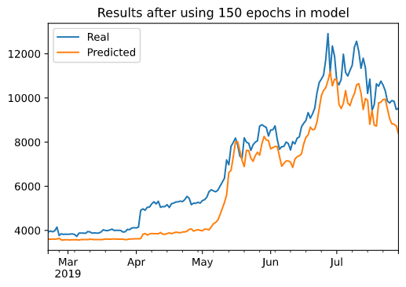
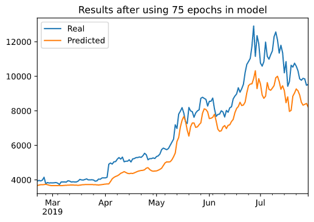

# Deep_learning

# LSTM Stock Predictor

Due to the volatility of cryptocurrency speculation, investors will often try to incorporate sentiment from social media and news articles to help guide their trading strategies. One such indicator is the [Crypto Fear and Greed Index (FNG)](https://alternative.me/crypto/fear-and-greed-index/) which attempts to use a variety of data sources to produce a daily FNG value for cryptocurrency. 

*(Updated Index)*

So we build and evaluate deep learning models using both the FNG values and simple closing prices to determine if the FNG indicator provides a better signal for cryptocurrencies than the normal closing price data.

### Build and train custom LSTM RNNs

In each Jupyter Notebook, we create the same custom LSTM RNN architecture. In one notebook, we fit the data using the FNG values (lstm_stock_predictor_fng.ipynb). In the second notebook, we fit the data using only closing prices (lstm_stock_predictor_closing.ipynb).

Using the models we answer the following:

> Which model has a lower loss?
>
The lstm_stock_predictor_closing model has lower loss of 0.0109 compared to lstm_stock_predictor_fng model loss of 0.0758.

> Which model tracks the actual values better over time?
> 
The lstm_stock_predictor_closing model tracks the actual value better over time. This can be seen from the below charts. 
* LSTM closing price model with a window size of 10 and 150 epochs is better than same model run with 50 epochs. 

> Which window size works best for the model?
>
Window size of 10 works best for the model